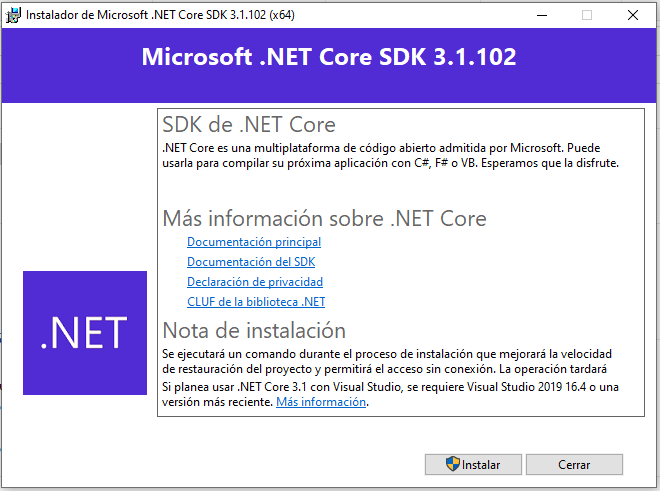

# Consigue el SDK

El Kit de Desarrollo de Software para .NET Core o SDK por sus siglas en ingles (Software Development Kit) es un conjunto de programas que permiten desarollar y ejecutar aplicaciones con la plataforma .NET e incluyen compiladores,gestor de paquetes, plantillas de proyectos y más.

Para instalar el SDK de .NET Core necesitas seguir las instrucciones especificas para el sistema operativo que usas por lo que te recomendamos seguir la documentación oficial: [Instalación del SDK de .NET Core](https://docs.microsoft.com/es-es/dotnet/core/install/sdk).

De manera ilustrativa te mostramos el proceso detallado para el sistema operativo Windows

1. Descarga el SKD de .NET Core desde la [página oficial](https://dotnet.microsoft.com/download)
2. Ejecuta el instalador dotnet-sdk-3.1.102-win-x64



> **Nota sobre la telemetría** El equipo de .NET ha decidido activar la recopilación de datos de uso y problemas con el las herramientas de linea de comandos de .NET Core esto ha causado plemica . Para más detalles ve [](https://docs.microsoft.com/en-us/dotnet/core/tools/telemetry)

Después de que el SDK ha finalizado de instalarse, abre una Terminal (o PowerShell en Windows) y usa la herramienta de linea de comando `dotnet` (también conocida como **CLI**) para asegurarte que todo está funcionando:

```text
dotnet --version

3.1.101
```

Puedes obtener más información acerca de tú plataforma con la opción `--info`:

```text
dotnet --info

SDK de .NET Core (reflejando cualquier global.json):
 Version:   3.1.101
 Commit:    b377529961

Entorno de tiempo de ejecución:
 OS Name:     Windows
 OS Version:  10.0.18363
 OS Platform: Windows
 RID:         win10-x64
 Base Path:   C:\Program Files\dotnet\sdk\3.1.101\

Host (useful for support):
  Version: 3.1.1
  Commit:  a1388f194c

.NET Core SDKs installed:
  3.1.101 [C:\Program Files\dotnet\sdk]

.NET Core runtimes installed:
  Microsoft.AspNetCore.App 3.1.1 [C:\Program Files\dotnet\shared\Microsoft.AspNetCore.App]
  Microsoft.NETCore.App 3.1.1 [C:\Program Files\dotnet\shared\Microsoft.NETCore.App]
  Microsoft.WindowsDesktop.App 3.1.1 [C:\Program Files\dotnet\shared\Microsoft.WindowsDesktop.App]

To install additional .NET Core runtimes or SDKs:
  https://aka.ms/dotnet-download
```

Si ves una salida similar a la de anterior, estas listo para comenzar.
